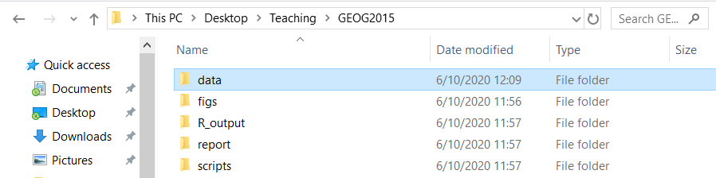

This lesson is the last of this small introduction to R! Here there will be even more practice as we will be manipulating a real dataset and you will learn some of the basic functions to inspect a dataset! For this lesson I expext you to get a good understanding of what a data frame is :)

You will learn:

- Load CSV data
- Inspect the basic properties of a data frame such as its size, class and type of data it contains
- Generate summary statistics for a dataframe
- Use indexing to select rows and columns
- Add columns and rows to the data frame

# Loading the data frame

R can read a wide range of data format including xlsx documents (your excell spreadsheet). One of the most common format is the XLS file. It is basically the excell document.

First, you will download the dataset available on blackboard: `worldbank_df.xls`. Save it in the relevant folder (remember the first lesson). For instance my main folder is GEOG2015 and I save in the subfolder `data`:

```{r, echo = FALSE}

```

Now that your csv file is saved in the right folder you are almost ready to read the file! Remember the first lesson about projects and working directories? If not read the section again because it is important at this very moment!

If you have made a R project (as you should have) the working directory is already set and you just need to load your data.

Otherwise you need to set the working directory with setwd. To do so click right on `WorldView.csv > properties > copy paste the location in setwd()` as follow:

```{r, eval= FALSE}
setwd("PATH/THAT/IS/WRITTEN")
```

Make sure you replace \ (that R do not understand) by /!

Now is time to open your data! For that we need to use the function `read.xlsx()` from the library xlsx. First you need to install the library `xlsx`:

```{r, eval = FALSE}
install.packages('xlsx')
```

And then load the library:

```{r}
library(xlsx)
```

Now you can open your document with the function described above.

If you are in the project write:

```{r}
data <- read.xlsx("data/worldbank_df.xlsx", sheetIndex = 1)
```

If you are not in a project write (with your own path):

```{r, eval = FALSE}
setwd('//home.ansatt.ntnu.no/benjamcr/Desktop/Teaching/GEOG3006/')
data <- read.xlsx('data/worldbank_df.xlsx', sheetIndex = 1)
```

Now, this line of code doesn’t produce any output in the console because, as you might recall, **assignments don’t display anything**. If we want to check that our data has been loaded, we can print the variable’s value by running data. If you do that you have your whole dataset printed in your console! That is not very handy and we need to find other strategies to inspect the data frame reasonably . . . We can for instance use the function head() to inspect the firsts 6 lines:

```{r}
head(data)
```

Much better! Like this we get a good overview of the dataset without being overwhelmed by too much data!

# A bit more about our training dataset

The dataset is composed of 7 columns:

- name: name of the countries present in the dataset
- iso_a2: a 2 letter code identifying the country
- HDI: the Human Development Index
- urban_pop: Urban population number within the countries
- unemployment: unemployment rate
- pop_growth: growth rate of the population within the country
- literacy: the percentage of population which is litterate

# Inspecting dataframe objects

Remember how we defined a data frame in the previous lesson? Okay just a quick reminder: a data frame is a **representation of data where the columns are vectors that all have the same length**. Because the columns are vectors, they all contain the same type of data (e.g. numeric, characters). But the type of data can vary BETWEEN vectors!

You can inspect the structure of a data frame with the function str():

```{r}
str(data)
```

As you can see, the column `name` is a factor (we will se what is a factor a bit later in this lesson) while `urban_pop` is numeric, does that make sense?

So we already learned how to use str() and head() but there is much much more functions to inspect a dataframe! I would like you to play around with them! :)

To inspect size:

- dim()
- nrow()
- ncol()
- length()

To inspect names of rows and columns:

- colnames()
- rownames()

To summarize the data frame:

- summary()
- str()

Now this is a non-exhaustive list and there is more! However in my experience these are the most useful you need to know!

Small exercise: play with the functions and try to figure out what they do exactly! You can use the help from R ?

# Indexing and subsetting dataframes

The `worldbank_df` dataset has two dimensions (rows and columns) and if we want to extract some specific information from it we need to specify the coordinates we want from it. It is like subsetting a matrix (remember the previous lesson!): rows come first and it is followed by column number:

```{r, eval = FALSE}
data[ 1 , 1 ] #First element in the first column
data[ 1 , 3 ] #First element in the third column
data[ , 1 ] #First column
data[ 4 , ] #Fourth row
data[ 1:10 , 1 ] #Rows 1 to 10 from the first column
#And so forth and so on ... Just try to play with that!
```

You can also subset the columns of a data frame using their names:

```{r, eval = FALSE}
data[ , "name" ] # I subset the column name -> the result will be a vector!
data[ , c("name", "unemployment") ] # I subset the columns name and unemployment -> #the result will be a dataframe
```

Another way for subsetting columns of a data frame is using `$`

```{r, eval=FALSE}
data$name # It is equivalent to data[ , "name" ]
```

Exercise: create a data frame `country_pop` by subsetting `name`, `urban_pop`
and `pop_growth`. Inspect this new dataframe using the functions we learned.

# Conditional subsetting

Often, we need to extract a subset of a data frame based on certain conditions. For instance, if I want to have a look at some specific countries . . . let’s say Norway:

```{r, eval=FALSE}
data[data$name == "Norway" , ] # This line of code tells R to subset the row in which "name" equal Norway
```

Now if I want to create a new dataset by subsetting only France and Norway I would do like this:

```{r}
NOR_FRA <- data[data$name == "Norway" | data$name == "France", ]
NOR_FRA
```

I must admit there is a much simpler way but this require a bit more knowledge about R. However doing as describe above will give you a better understanding of how the R structures work. For those who are intereseted have a look at the function `filter()` from the `dplyr` package.

# Adding and removing rows and columns

I can add columns to a data frame using the cbind() function. For instance, let’s say I want to create a column “ID” which assigns a number to each country. I first create the vector and add it to the dataframe:

```{r, eval= FALSE}
ID <- 1:nrow(data) #A vector going from 1 to 160 (which is the length of my data frame)
cbind(data, ID)
```

To add rows to a data frame we need to use the function `rbind()`.

# Categorical data: factors

Remember when I told you that in R there is more data type than only numeric and character? Well factor is another important type of data and deserve a section on its own!

When we did str(data) we saw that `name` was a factor right? Well, factors are very useful and are actually something that make R particularly well suited to working with data, so we’re going to spend a little time introducing them.

Factors are used to represent `categorical data`. Factors can be ordered or unordered, and understanding them is necessary for statistical analysis and for plotting.

Factors are stored as integers, and have labels (text) associated with these unique integers. While factors look (and often behave) like character vectors, `they are actually integers under the hood`, and you need to be careful when treating them like strings.

Once created, factors can only contain a pre-defined set of values, known as levels. By default, R always sorts levels in alphabetical order. For instance, if you have a factor with 2 levels:

```{r}
sex <- factor(c("man", "woman", "woman", "man", "woman"))
```

R will assign the value of 1 to the level man and the value 2 to the level woman. You can check this by using the functions `levels()` and `nlevels()`.

```{r}
levels(sex)
nlevels(sex)
```

Sometimes the order of the factors do not matter (here that would be the same if the level `woman` has the value 1 but there is some cases when it is meaningful: a value of 1 for “low”, 2 for “moderate” and 3 for “high” would make sense.

## Reordering levels

It is possible to reorder the levels of a vector:

```{r}
sex #gives the current order of the levels
sex <- factor(sex, levels = c('woman','man')) # I reorder
sex # after re ordering
```


## Converting factors

Sometimes, R open that dataframe and thinks one of the column is a factor while in reality it is not (such as it is the case for `name` here). In these cases we need to convert the data type

If you need to convert a factor vector to a character vector use the function `as.character()`

```{r, eval = FALSE}
as.character(data$name)
```

If you need to convert factors where the levels appear as numbers (such as dates) to a numeric vector you need to first convert factors to character and then numbers:

```{r}
dates <- factor(c(1500,1600,1700,1800,1900,2000))
as.numeric(as.character(dates)) #Looks a bit complicated but works well
```

# Some questions!

As usual you have a task to complete! This task may take a bit more time and research but I am sure you are able to complete it :)

We discovered a new country whom name is “Wakanda”! Using all your previous knowledge add a new row to the data frame. the `iso_a2` code for Wakanda is “WA” and you can choose the other values (you can choose to make Wakanda a very litterate country or not for instance)

# End of the tutorial

You made it until the end of this -short- tutorial about R! While I tried to be concise keep in mind that R is much much more than what you learned! However, this tutorial will give you the basics to handle to most common data structures that you will find. 

In the exercises we will learn much more things, and especially how to turn R into a GIS software!

