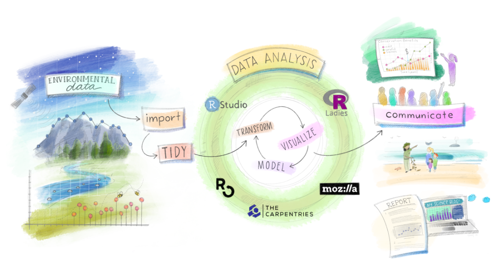

```{r}

```

### Part 1: Data Vizualisation

In this module you will learn how to explore efficiently your dataset and how to make effective graph.

[Lab 1: Introduction to data visualization and ggplot2](Lab1_DataViz.html)

[Lab 2: Data visualization - Part 2](Lab2_DataViz.html)

[Lab 3: Data visualization & data wrangling - Part 3](Lab3_DataViz.html)

[Lab 4: Data visualization & data wrangling - Part 4](Lab4_DataViz.html)

### Part 2: Modelling data & Statistical inference

[Lab 5: Modelling with a single predictor](Lab5_Model.html)

[Lab 6: Modelling with a single predictor - Part 2](Lab6_Model.html)

[Lab 7: Modelling with a single predictor - Part 3](Lab7_Model.html)

[Lab 8: Case study on ESS9](Lab8_Model.html)

### Part 3: Communicating your results (Open science & reproducibility)

[Lab 9: Introduction to Rmarkdown](ex/Lab9_Rmarkdown.html)

### Part 4: Looking forward!

Congratulation! You made it through the labs and by now you should be relatively comfortable with R and with wrangling, analyzing and visualizing your datasets. Practice will make your data science skills stronger and if you wish to continue with Quantitative Methods in the future I recommend you to try new things and learn new concepts. Here I provide some resources that can be useful for your future in data science.

[4.1 Data Ethics](https://rstudio-education.github.io/datascience-box/course-materials/slides/u3_d01-ethics/u3_d01-ethics.html#41) : Data ethics is important as coding statistics and Machine Learning algorithms is a matter of choice, choice in your data, in what you want to visualize ... This slides guide you through some of the good choices you need to make.

[4.2 Interactive data visualization](https://rstudio-education.github.io/datascience-box/course-materials/slides/u3_d02-shiny-1/u3_d2-shiny-1.pdf): You can take you visualization level further by making interactive plots in R! 

I wish you good luck with your term paper and I wish you to have a successful career!


