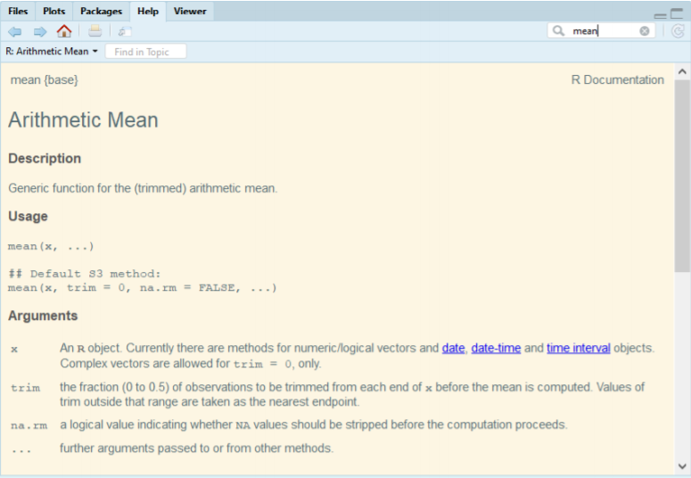

Welcome back to this introduction to R! In this lesson you will have more applied work and I promise it will
be fun! This lesson is important as it lays the fundation for literally everything else, so stay focus :)
What you will learn:

- Create R objects
- Do some simple math using R objects
- Call functions with arguments
- Download, install and load R packages
- Learn where to find the good information when you face a problem

# Creating objects in R

To do things in R we need to assign values to objects. To do so, we write a name followed by the assignement operator <- or = and the value we want to give it:

```{r}
my_age <- 23

# Or

my_age = 23
```

We can read this line of code as 23 goes into the object temperature. Then you need to run the line of code
(with either Run or Ctrl + Enter). Once you have executed the code you will see your object in the global
environment (the upper right window) with its value.
Now, there is some very important rules as of how to name objects in R:

• Objects names are explicits and shorts
• They cannot start with a number such as 2pac
• They cannot include space, if you need place an underscore _. Don’t write my age but
my_age
• R is **case sensitive**. For R, My_age is different from my_age
Now that R has my_age in memory you can do some math with it. For instance, you know that your aunt is
two times your age:

```{r}
my_age*2
```

You can even create a new object:

```{r}
aunt_age <- my_age*2
```

Note that you can change the value of an object. Let’s suppose I made a mistake and I wanted to write 27 instead of 23 for my_age. I only need to reassign the value:

```{r}
my_age <- 27
```

If you want to check that my_age has the good value you can force R to print the value by typing the object name. The value will appear in the console (down left)

```{r}
my_age
```

## Functions 

A function is a block of code which you can use whenever you need and wherever you required to avoid repeated code blocks. The function takes arguments to produce a result.
For instance, let’s assume you have coffee beans that you want to grind. You will put your beans in the grinder and will get the grinded coffee as a result. Well, your coffee beans are the arguments, the grinding process the function and the grinded coffee the result.
Many functions are predifined and you only need to call (or excecute) them. For instance you can square root my_age with the function sqrt():

```{r}
sqrt(my_age)
```

In R, there is function for everything, and if there is no function for what you want to do you can still create it (but we will not learn that here). Arguments can take a wide range of forms and can be numeric (such as my_age) or can even be entire files!

## Comments

As I stated in the previous lesson, you can comment your code with the hasthtag #. I repeat it because I would like you to use it extensively in your code, **commenting your code is always good!**. For instance to keep track of the units of your variables:

```{r}
my_age <- 27 # In years
bottle_weight <- 1 # Kilogram
distance <- 100 # Meters
```

## Objects vs variables

What are known as objects in R are also called variables in many other programming languages. Depending on the context, object and variable can have drastically different meanings but for this course we will use these two words synonymously.

# Vectors and data types

A **vector**| is the most basic data type in R. A vector is composed by a serie of values, which can be either numbers of characters. Now, this is **very important** to note that a vector is composed of only **one type of data**. Either your vector is fully made of numbers or of characters (include letters or words). You can assign a series of values to a vector using the `concatenate` function. For instance let’s create a vector of age and assign it to the object `group_age`:

```{r}
group_age <- c(18,21,22,31,28,32,50, 42,38 ) # create the vector and assign it to group_age
group_age # I check if my object has been created and if it has the good values
```

There is some important functions that are used to inspect your vector. We can for instance check the length
of the vector using the function `length()``.

```{r}
length(group_age)
```

You can also get an overview of your vector with the function `str()`:

```{r}
str(group_age)
```

You can check the class (or the type) of your vector with `class()`:

Now for comparison let’s write a vector composed of words, let’s say 5 vegetables:

```{r}
vegetables <- c("tomatoes", "eggplant", "carrots", "salad", "onion")
class(vegetables)
```

Note that to specify a word or a letter you need to quote it "", otherwise R will think you are writing an
object.
Are you still following me? I hope you’re not lost yet! :) Okay just to check if you understood the notions of
vectors and functions try to answer the following questions:

Can you create a vector called `family` composed of the names of your parents, sisters and brothers?
Can you inspect its length and class?

# Manipulating vectors

Sometimes, we want to extract one or several values from a vector. For example, I want to know what is the second vegetable of my vector:

```{r}
vegetables[2]
```

You need to specify the position of what you want to know in the brackets []
If I want to know what are the 2nd and 3rd vegetables:

```{r}
vegetables[c(2,3)] #  I need to concatenate as my input is multiple values
```

You can also excludes some elements of your vector. Some people say that tomatoes is not a vegetables `tomatoes` need to exclude tomatoes from my vector of vegetables:

```{r}
vegetables[-1] #I don't have tomatoes anymore!

```

Now that you know the basics for subsetting vectors, let’s see something even more useful!

# Conditional subsetting

Another common way of subsetting is by searching for certain words (or strings in the programming language). We can use OR (at least one of the condition is true) with the operator | to test for equality to multiple values:

```{r}
vegetables[vegetables == "eggplant" | vegetables == "cucumber"]
```

Equivalently, if you have a numeric vector you can subset with the operators `<` (less than), `>` (more than) or `=` (equal). For instance, using the vector group_age I want to create a new vector with ages below 30:

```{r}
group_age < 30 #I check if there is numbers below 30
```

```{r}
inf_30 <- group_age[group_age < 30] # I create a new vector composed of ages below 30
inf_30 #I check if my object has been created
```

You can combine multiple tests using & (AND, both conditions are true) or |.
For instance, I want to create a dataset with ages below 30 OR over 40:

```{r}
new_age <- group_age[group_age < 30 | group_age > 40 ]
new_age
```

If I want to create a dataset with ages over 30 AND below 40:

```{r}
new_age2 <- group_age[group_age > 30 & group_age < 40]
new_age2
```

Subsetting is not an easy topic and require a lot of practices, so make sure you train! If you still struggle
with subsetting read [this](https://www.statmethods.net/management/subset.html)

# Missing data

As R was designed to analyze datasets, it includes the concept of missing data (which is uncommon in other programming languages). Missing data are represented in vectors as NA.
When doing operations on numbers, most functions will return NA if the data you are working with include missing values:

```{r}
heights <- c(1,3,5,3,2,1,NA,3,NA,4,5) # I assign a vector to "heights"
max(heights) # will return NA
```

You can add the arguent na.rm = TRUE to calculate the result while ignoring the missing values:

```{r}
max(heights, na.rm = TRUE) # will do the operation
```

Any real world dataset contains missing values and you will need to become familiar with some of the functions to deal with it! Don’t worry it’s not as scary as it sounds and we will do that in the exercises.

# Common data structures 

Even though understanding how vectors work is fundamental, R uses a lot of other data structures. The most importants are, without any doubts, the matrices, the data frames and the lists (but we will not study the lists here). Now there is a good news and a bad news . . . The bad news is that you need to know how these 3 data structures work and how to manipulate them, good news is that you only need to know 4 data structures and it’s not so complicated to manipulate them ;)

## Matrix

If we arrange data elements of a vector in a two-dimensional rectangular layout we have a matrix. To construct a matrix, we use a function conveniently called `matrix()`.

```{r}
my_matrix <- matrix(1:20, nrow=5, ncol=4) # Create a 5 x 4 numeric matrix
```

You can subset a matrix with [ row , column ]:

```{r}
my_matrix[ , 4] # I subset the 4th column of the matrix
my_matrix[3 , ] # I subset the 3rd row of the matrix
my_matrix[2:4 , 1:3] # I subset rows 2,3,4 and column 1,2,3 of the matrix
```

## Data frame

While matrix can only take numeric values, data.frame can contain any type of elements. The only rule is that all elements must have the same length.
A data frame is the most common way of storing tabular data in R and something you will likely deal with a lot. You can really think of a data frame as a table or an excell spreadsheet. For instance, let’s build a dataframe using the `data.frame()` function:

```{r}
group_df <- data.frame(Student = c("Kjersti", "Bjorn", "Patrick", "Karine", "Kristine"),
Eyes = c("blue", "green", "borwn", "blue", "brown"),
Height = c(1.88,1.56,1.78,1.98,1.75),
ScoreStat = c("B", "C", "B", "A", "B"),
StudentNumber = c(13,14,11,16,18))

group_df
```

You will know more about the data frame in the next lesson but for now try to do this small exercise:

Create a dataframe that holds the following information:

• Names of 5 of your family members (including you)
• Their favorite colour
• Their weights
• Their heights

# Extending R base functionality

R comes with a base system and some contributed core packages. This is what you downloaded and installed previously. The functionality of R can be significantly extended by using additional contributed packages.

Those packages typically contain commands (functions) for more specialized tasks. For instance, you can turn R into a “Geographical Information System - GIS” using the packages “Raster” or do text mining in R with the package “tm”.

# Downloading and installing additional R packages

To install packages there is two main options: 

1.You can use RStudio interface: In the menu at the top of your window: Tools > Install packages 
2.You can install the package from the R console like this:

```{r, eval = FALSE}
install.packages("dplyr") #to install the package "dplyr"
```

The second method is the method I would recommand as you can customize the function call by adding some arguments.

# Using the installed packages

Downloading the packages is not enough, you need to tell R that you want to use them! To access the functions of your newly downloaded package you need to specify:

```{r}
library(dplyr)
```

A small advice . . . All packages in R have a description, if you want to see what are the possibilities of a
package you can google it. For instance, if you google “dplyr + pdf” you will find this, which is a complete
description of the dplyr package.

# I need some help!

If you are stuck with your script **don’t stay passive and look for help**.

As I stated in the previous lesson, every single programmer will need help at some point. I must say, the most important skill for a programmer is not to know every function, or know perfectly how to program but it is to know how to look for help. Looking for help is the single most important skill you need to know !

## Use the built-in RStudio help interface

This is the most direct way to seek help! You can use the button “Help” from the down-right window and write the function you are looking for in the small area where I wrote “mean”. This will give me all the help I need to make sense of the `mean()` function!

```{r, echo = FALSE}

```

Instead of writing the name of the function in this small area you can directly ask for help by typing in the Console:

```{r, eval = FALSE}
?mean
```

## You are stuck, you get an error message and you want to break your computer

Yes, I get this feeling quite often. When I reach this point the best is to look for help on Google! Google is your friend as they say, but in the programming world google is your best friend. You can start by copy and paste your error message on google and look at the firsts few lines. In general that work and someone else alreay got the problem you are facing. Most of the time, the first matches from your google search will redirect you to the website stackoverflow. 

Stackoverflow has the answer in 99% of the cases.

## Where else can I ask for help?

Ask your classmates! Every one has a different eye and if you cannot find your mistake maybe your classmates
can!
Or send your question on the blackboard forum! I / or a classmate will try to answer as fast as I can (if I’m not stuck with my script too, that happens a lot ;) )

# Some questions

- Exercise 1: Create 2 numerical vectors, one for height and one for weight. Make sure they have the same length (you can use length function). Create a third object which is the result of the addition of height and weight.
- Exercise 2: create a vector price_houses made of the values 100, 200, 50, 400, 60, 600, 200, 300, 40, 70.  Now create a vector cheap_houses by subsetting the values below or equal to 100. Create another vector moderate_houses by selecting values between 100 and 300.

Answer the following questions:

- What are the basic rules you need to follow to give a name to a variable?
- What are the fundamental differences between a vector, a matrix and a dataframe?
- What is the function head() made for?